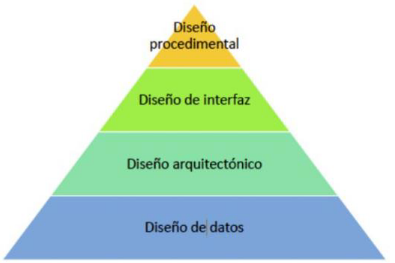

# Tema 1

## Etapas de desarrollo de un programa

**Análisis**

- _Funcionales_: funciones tendrá que realizar la aplicación. Como se comporta en situaciones inesperadas.
- _No funcionales_: tiempos de respuesta, simultaneidad de peticiones.. etc.

**Diseño**

1. _Diseño de datos_: Diagramas de clases (clases, atributos.. etc). Entidades.
2. _Diseño arquitectonico_: Como organizamos los datos entidad relacion, como se definen.
3. _Diseño de interfaz_: App movil (donde va el menu, los botones etc), API Rest (app que contesta a otra).
4. _Diseño procedimental_: Pseudocodigo, diagramas de flujo.
---
### Clasificaciones de lenguajes de programacion

1. __Según nivel de abstraccion__
   - Bajo nivel: 0 y 1.
   -  Medio nivel
   -  Alto nivel: Es en el nivel que trabajaremos

    **A mayor nivel, mayor legitibilidad del código**

2. __Según paradigma de programación__
   -  Estructurada: secuencias, condicionales, bucles..
   -  POO

3. __Según forma de ejecución__
   -  Compilados: Coge todo el codigo y el compilador lo traduce a ceros y unos (0,1). Ejemplo: C, C++
   -  Interpretados: Siempre vas a hacer traducciones, traduce en bitecode. Ejemplo: Python

**_Python usaremos procedimental estructurada_**. Lo usamos por que es un lenguaje interpredo y nos permite hacer prueba y error

**_Comparativa general_**

- **Compilados**:
  - Más eficiente (gestiona mejor los recursos del sistema).
  - Optimización proceso compilacion.
  - El rendimiento.
- **Interpretados**:
  - Prototipado de código (prueba y error hsata llegar a la solucion más óptima).

**Se busca que los lenguajes de programación de IA sean**:

- Simple.
- Capacidad de prototipado.
- Que sea facil de leer.
- Que existan muchas librerias/bibliotecas (numpy, pandas, scikit-learn, pytorch, keras, tensorflow..).
- La comunidad de desarrollo.

**Lenguajes mas usados para IA**:

- Python
- LISP (antiguo)
- PROLOG
- R (estadistica)
- Haskell
- Java
- C++

#### Links cheetsheet markdowns
1. [Markdown Cheetsheet](https://www.markdownguide.org/cheat-sheet/)
2. [Markdown Cheetsheet 2](https://www.markdown-cheatsheet.com/)

